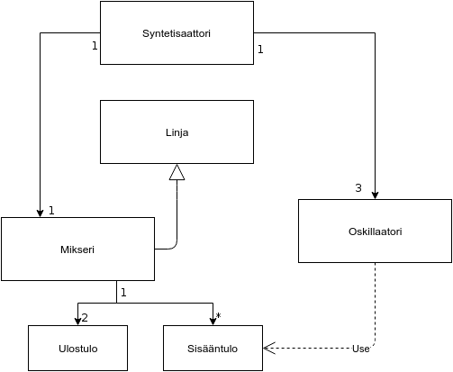

#Oskillaattori

##Kuvaus
Pyrkimyksenä on luoda yksinkertainen oskillaattori javalla. Oskillaattori on eräänlainen nykymusiikissa käytetty soitin. 
Muokkaamalla äänikortille lähetettävää signaalia ja liittämällä useampia elementtejä yhteen voidaan soittaa monimutkaisia ääniä.

#####Käyttäjä:
Musiikinharrastaja tai siitä kiinnostunut

#####Käyttäjän toiminnot:
-Käyttäjä voi luoda ja muokata ääntä käyttöliittymän kautta
-Käyttäjä voi soittaa luomaansa ääntä koskettimilla

